<div align="center">

# 👋 Olá, eu sou Diego Rosa

### Data Scientist | AI Enthusiast | Problem Solver

<p align="center">
  <a href="https://www.linkedin.com/in/rdiegosilva"></a>
  <a href="mailto:diegodg22@outlook.com"></a>
  <a href="https://seu-site.com"></a>
</p>


</div>

---

## 🤖 Sobre Mim

```python
class DiegoRosa:
    def __init__(self):
        self.role = "Aspirante a Data Scientist & AI Engineer"
        self.education = "Análise e Desenvolvimento de Sistemas"
        self.currently_learning = ["Machine Learning", "Deep Learning", "Python"]
        self.databases = ["MySQL", "PostgreSQL"]
        self.interests = ["Computer Vision", "NLP", "Predictive Analytics"]
    
    def current_goal(self):
        return "Construir soluções inteligentes que transformam dados em valor"
    
    def fun_fact(self):
        return "Acredito que a IA não vai substituir humanos, mas humanos com IA vão substituir humanos sem IA!"
```

Sou um **entusiasta de dados e inteligência artificial** em constante evolução. Fascinado por como algoritmos podem aprender padrões, fazer previsões e resolver problemas complexos. Atualmente mergulhado no universo de **Machine Learning**, **análise de dados** e **modelagem preditiva**.

---

## 🛠️ Arsenal Tecnológico

<div align="center">

### 🐍 Data Science & AI Stack
<p>
  
  
  
  
  
</p>

### 💾 Databases & Tools
<p>
  
</p>

### 🌐 Conhecimentos Complementares
<p>
  
</p>

</div>

<details>
<summary><b>🎯 Áreas de Foco em IA & Data Science</b></summary>
<br>

- 🧠 **Machine Learning** - Algoritmos supervisionados e não supervisionados
- 🔮 **Deep Learning** - Redes Neurais, CNN, RNN
- 📊 **Análise Exploratória de Dados** - Visualização e insights
- 🤖 **NLP** - Processamento de Linguagem Natural
- 👁️ **Computer Vision** - Reconhecimento de padrões em imagens
- 📈 **Modelagem Preditiva** - Previsão e classificação
- 🔬 **Feature Engineering** - Otimização de features para modelos

</details>

---

## 📊 GitHub Analytics

<div align="center">
  
  
</div>

<div align="center">
  
</div>

---

## 🐍 Contribuições sendo Devoradas

<div align="center">
  <picture>
    <source media="(prefers-color-scheme: dark)" srcset="https://raw.githubusercontent.com/yInvictus1/yInvictus1/output/github-snake-dark.svg" />
    <source media="(prefers-color-scheme: light)" srcset="https://raw.githubusercontent.com/yInvictus1/yInvictus1/output/github-snake.svg" />
    
  </picture>
</div>

---

## 📈 Gráfico de Atividade

<div align="center">
  
</div>

---

## 🏆 Troféus do GitHub

<div align="center">
  
</div>

---

## 💡 O Que Me Move

<table>
  <tr>
    <td align="center" width="33%">
      
      <h3>🔬 Curiosidade</h3>
      <p><i>"Cada dataset conta uma história. Meu trabalho é descobri-la."</i></p>
    </td>
    <td align="center" width="33%">
      
      <h3>📚 Aprendizado</h3>
      <p><i>"Machine Learning é 10% algoritmo e 90% limpeza de dados... e café."</i></p>
    </td>
    <td align="center" width="33%">
      
      <h3>🚀 Inovação</h3>
      <p><i>"A IA é a ferramenta, mas a criatividade humana é o diferencial."</i></p>
    </td>
  </tr>
</table>

---

## 🎓 Jornada de Aprendizado

```mermaid
graph LR
    A[📚 Fundamentos] --> B[🐍 Python]
    B --> C[📊 Análise de Dados]
    C --> D[🤖 Machine Learning]
    D --> E[🧠 Deep Learning]
    E --> F[🚀 AI Engineer]
    
    style A fill:#0D1117,stroke:#00D9FF,stroke-width:2px,color:#00D9FF
    style B fill:#0D1117,stroke:#00D9FF,stroke-width:2px,color:#00D9FF
    style C fill:#0D1117,stroke:#00D9FF,stroke-width:2px,color:#00D9FF
    style D fill:#0D1117,stroke:#00D9FF,stroke-width:2px,color:#00D9FF
    style E fill:#0D1117,stroke:#00D9FF,stroke-width:3px,color:#00D9FF
    style F fill:#0D1117,stroke:#FFD700,stroke-width:4px,color:#FFD700
```



---

## 🔥 Estatísticas em Tempo Real

<div align="center">


</div>

---

## 📫 Vamos Conversar sobre IA e Dados?

<div align="center">

Estou sempre aberto a discutir sobre **Data Science**, **Machine Learning** e oportunidades de colaboração!

**📧 Email:** diegodg22@outlook.com  
**💼 LinkedIn:** [/rdiegosilva](https://www.linkedin.com/in/rdiegosilva)  
**🌐 Portfolio:** [Visite meu site](https://seu-site.com)

</div>

---

<div align="center">
  
### 💭 Citação Inspiradora

*"Dados são o novo petróleo, mas diferente do petróleo, os dados não se esgotam. Eles se multiplicam!"*

<br>


</div>
